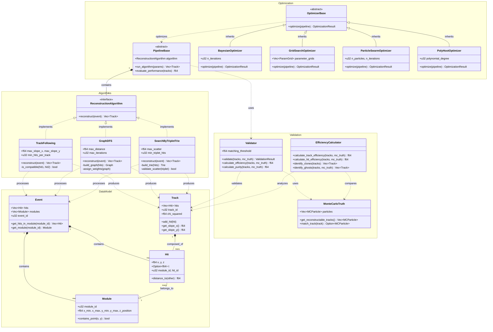

# velopix

**Velopix** is a high-performance track reconstruction framework designed for processing collision data from the LHCb detector at CERN. It reconstructs particle trajectories by analyzing hit patterns recorded across multiple detector modules using a hybrid Rust-Python architecture that combines computational efficiency with algorithmic flexibility.

---

## Architecture Overview

Velopix implements a layered architecture with core computational components written in Rust and exposed through Python bindings via PyO3. The framework consists of four primary modules:

### Core Components

**Event Model (`event_model`)**: Defines the fundamental data structures for detector geometry and particle interactions. The `Event` class represents collision data across 52 detector modules, with `Hit` objects representing spatial coordinates (x, y, z) and optional temporal information. `Module` objects provide geometric boundaries and hit indexing, while `Track` objects represent reconstructed particle trajectories.

**Reconstruction Algorithms (`algorithms`)**: Implements three distinct algorithmic approaches for track reconstruction:

1. **Track Following**: A greedy forward-tracking algorithm that builds tracks by extending hit sequences based on slope compatibility criteria. For hits $h_0$ and $h_1$, compatibility is determined by:

   $$|x_1 - x_0| < \text{max\_slope}_x \times |z_1 - z_0|$$
   $$|y_1 - y_0| < \text{max\_slope}_y \times |z_1 - z_0|$$

2. **Graph DFS**: A graph-based approach that constructs segments between hit pairs and uses depth-first search with iterative weight assignment. Segments are weighted based on their connectivity, and tracks are extracted from high-weight paths through the graph structure.

3. **Search by Triplet Trie**: A pattern-matching algorithm that builds tracks from compatible triplets of hits. Uses a trie data structure to efficiently store and retrieve compatible hit combinations, with scatter validation:
   $$\text{scatter} = \frac{dx^2 + dy^2}{dz_{12}^2} < \text{max\_scatter}$$

**Validation Framework (`validator`)**: Provides comprehensive track quality assessment through Monte Carlo truth matching. Computes efficiency metrics, purity measures, and identifies clone and ghost tracks using configurable matching criteria.

**Hyperparameter Optimization (`hyperParameterFramework`)**: A Python-based optimization suite supporting multiple search strategies including Bayesian optimization, grid search, particle swarm optimization, and polynomial heuristic optimization (PolyHoot). Provides algorithm-specific pipeline implementations for systematic parameter tuning.

### Class Interactions

The framework follows a pipeline architecture where `Event` objects flow through reconstruction algorithms to produce `Track` collections. The `Validator` compares reconstructed tracks against Monte Carlo truth data, while the hyperparameter framework orchestrates algorithm execution and performance optimization.

---

## Features

- **High-Performance Core**: Rust implementation with parallel processing capabilities via Rayon
- **Multiple Reconstruction Strategies**: Three complementary algorithms optimized for different detector conditions
- **Comprehensive Validation**: Monte Carlo truth matching with detailed efficiency and purity metrics
- **Hyperparameter Optimization**: Automated parameter tuning with multiple optimization strategies
- **Flexible Data Model**: Support for both spatial (x,y,z) and temporal (t) hit information
- **Modular Architecture**: Extensible design supporting custom algorithm development

---

## Mathematical Foundations

The reconstruction algorithms employ geometric constraints and statistical methods:

- **Slope Compatibility**: Linear trajectory assumption with configurable tolerance bounds
- **Scatter Validation**: Chi-squared-like metric for track quality assessment
- **Weight Assignment**: Iterative graph weighting based on segment connectivity
- **Efficiency Calculation**: Ratio of correctly reconstructed to reconstructable tracks

---

## Use Cases

Velopix is designed for:

- High-energy physics researchers analyzing LHCb detector data
- Algorithm developers comparing reconstruction performance
- Research teams requiring optimized tracking pipelines
- Educational applications in particle physics data analysis

---

## Documentation

Full documentation is available online:

- [Installation Guide](https://github.com/SvenHockers/velopix/blob/main/docs/installation.md)
- [System Overview](https://github.com/SvenHockers/velopix/blob/main/docs/installation.md)
- [API Reference](https://github.com/SvenHockers/velopix/blob/main/docs/api.md)

---

## License

This project is licensed under the MIT License. See the [LICENSE](https://github.com/SvenHockers/velopix/blob/main/LICENSE) file for details.
