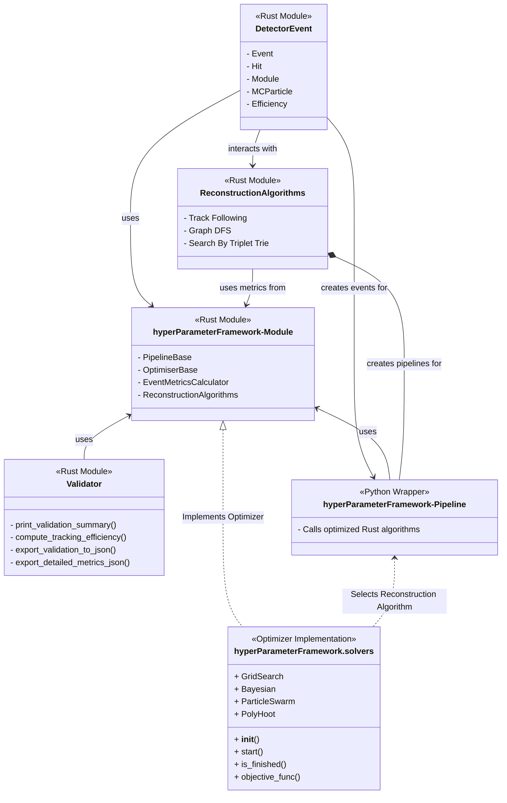

# System Overview

Velopix follows a modular design:

* **DetectorEvent**: Represents events, modules, hits, and particles.
* **ReconstructionAlgorithms**: Plug-and-play components implementing different reconstruction strategies.
* **Pipelines**: High-level interface for running algorithms on input data.
* **Validator**: Evaluate reconstruction performance and correctness.
* **Solvers**: Implementation of Hyperparameter reconstruction algorithm optimisation tools.

This architecture supports experimentation, testing, and integration into broader data workflows.

---
### **4. System Architecture Overview**  

The framework is structured into modular components to facilitate **performance optimization and algorithm development**. The following diagram illustrates the interaction between key modules. For a more detailed overview, see [this reference](./docs/abstractions_diagram.md).

---