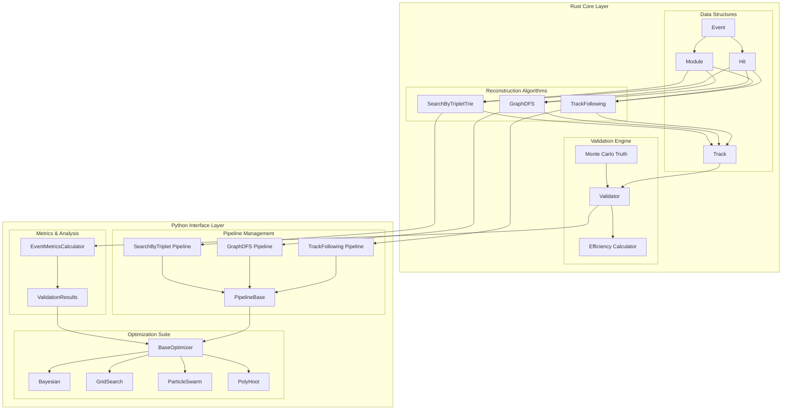

# System Overview

Velopix implements a hybrid Rust-Python architecture designed for high-performance particle track reconstruction in the LHCb detector environment. The system combines the computational efficiency of Rust with the flexibility and ecosystem of Python.

## Core Architecture

The framework is organized into four primary modules that work together to provide a complete reconstruction pipeline:

### Data Layer: DetectorEvent Module

The foundation of the system, implemented in Rust for optimal performance:

- **Event**: Encapsulates collision data across 52 detector modules with spatial and temporal hit information
- **Hit**: Represents individual particle interactions with coordinates (x, y, z) and optional time data
- **Module**: Defines detector geometry boundaries and provides efficient hit indexing
- **Track**: Represents reconstructed particle trajectories as sequences of hits

### Algorithm Layer: ReconstructionAlgorithms Module

Three complementary reconstruction strategies, each optimized for different detector conditions:

**Track Following Algorithm**:
- Greedy forward-tracking approach
- Builds tracks by extending hit sequences based on slope compatibility
- Mathematical constraint: `|x₁ - x₀| < max_slope_x × |z₁ - z₀|`
- Optimal for high-momentum, straight-line trajectories

**Graph DFS Algorithm**:
- Graph-based approach using depth-first search
- Constructs segments between hit pairs with iterative weight assignment
- Extracts tracks from high-weight paths through the graph structure
- Effective for complex track topologies and curved trajectories

**Search by Triplet Trie Algorithm**:
- Pattern-matching using trie data structures
- Builds tracks from compatible triplets with scatter validation
- Scatter metric: `scatter = (dx² + dy²) / dz²₁₂ < max_scatter`
- Efficient for dense hit environments with multiple overlapping tracks

### Validation Layer: Validator Module

Comprehensive track quality assessment system:

- **Monte Carlo Truth Matching**: Compares reconstructed tracks against simulation truth
- **Efficiency Metrics**: Calculates reconstruction success rates
- **Purity Measures**: Assesses track quality and contamination
- **Clone and Ghost Detection**: Identifies duplicate and spurious tracks

### Optimization Layer: HyperParameter Framework

Python-based optimization suite for systematic parameter tuning:

- **Pipeline Orchestration**: Algorithm-specific pipeline implementations
- **Multi-Strategy Optimization**: Bayesian, grid search, particle swarm, and PolyHoot algorithms
- **Performance Metrics**: Automated evaluation and comparison
- **Configuration Management**: Parameter space exploration and validation

## System Architecture Diagram

```mermaid
graph TB
    subgraph "Rust Core Layer"
        subgraph "Data Structures"
            Event[Event]
            Hit[Hit]
            Module[Module]
            Track[Track]
        end
        
        subgraph "Reconstruction Algorithms"
            TF[TrackFollowing]
            GD[GraphDFS]
            ST[SearchByTripletTrie]
        end
        
        subgraph "Validation Engine"
            Val[Validator]
            Eff[Efficiency Calculator]
            MC[Monte Carlo Truth]
        end
    end
    
    subgraph "Python Interface Layer"
        subgraph "Pipeline Management"
            PipeBase[PipelineBase]
            TFPipe[TrackFollowing Pipeline]
            GDPipe[GraphDFS Pipeline]
            STPipe[SearchByTriplet Pipeline]
        end
        
        subgraph "Optimization Suite"
            OptBase[BaseOptimizer]
            Bay[Bayesian]
            Grid[GridSearch]
            PSO[ParticleSwarm]
            PH[PolyHoot]
        end
        
        subgraph "Metrics & Analysis"
            EventMetrics[EventMetricsCalculator]
            Results[ValidationResults]
        end
    end
    
    %% Data flow connections
    Event --> Hit
    Event --> Module
    Hit --> TF
    Hit --> GD
    Hit --> ST
    Module --> TF
    Module --> GD
    Module --> ST
    
    TF --> Track
    GD --> Track
    ST --> Track
    
    Track --> Val
    MC --> Val
    Val --> Eff
    
    %% Python interface connections
    TF --> TFPipe
    GD --> GDPipe
    ST --> STPipe
    TFPipe --> PipeBase
    GDPipe --> PipeBase
    STPipe --> PipeBase
    
    PipeBase --> OptBase
    OptBase --> Bay
    OptBase --> Grid
    OptBase --> PSO
    OptBase --> PH
    
    Val --> EventMetrics
    EventMetrics --> Results
    Results --> OptBase
```

## Data Flow and Processing Pipeline

1. **Event Ingestion**: Raw detector data is parsed into `Event` objects containing `Hit` collections organized by `Module`

2. **Algorithm Selection**: One of three reconstruction algorithms is instantiated with specific parameters

3. **Track Reconstruction**: The selected algorithm processes hits to generate `Track` candidates

4. **Validation**: Reconstructed tracks are compared against Monte Carlo truth data

5. **Optimization**: The hyperparameter framework evaluates performance and suggests parameter improvements

## Mathematical Foundations

The reconstruction algorithms employ several key mathematical concepts:

**Geometric Constraints**:
- Linear trajectory assumption with slope tolerance bounds
- Spatial compatibility checks between consecutive hits
- Angular scatter validation for track quality assessment

**Statistical Methods**:
- Chi-squared-like metrics for goodness-of-fit evaluation
- Efficiency calculations as ratios of successful reconstructions
- Multi-objective optimization with weighted scoring functions

**Graph Theory**:
- Segment connectivity analysis in the Graph DFS approach
- Weight propagation through directed acyclic graphs
- Path extraction using depth-first traversal

## Performance Characteristics

- **Parallel Processing**: Rust implementation with Rayon for multi-threading
- **Memory Efficiency**: Zero-copy data structures where possible
- **Batch Processing**: Optimized for processing multiple events simultaneously
- **Scalability**: Linear scaling with detector module count and hit density

## Integration Points

The modular architecture supports integration with:

- **LHCb Data Acquisition Systems**: Direct event data ingestion
- **Analysis Frameworks**: ROOT, Pandas, and custom analysis pipelines
- **Visualization Tools**: Track display and performance monitoring
- **Distributed Computing**: Batch processing on computing clusters